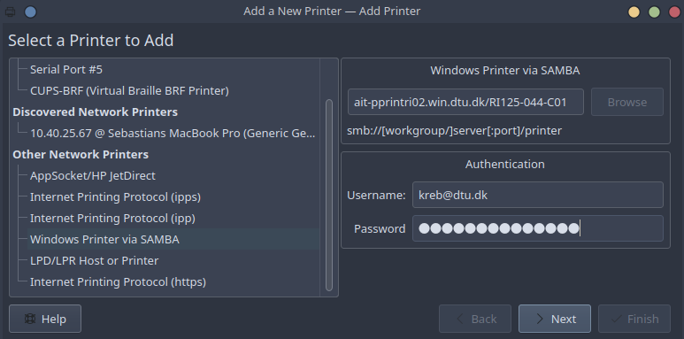

# Configuration Files
This repository contains my configuration files for the most critical applications used. Further, this readme contains a list of commonly used applications which are relevant to install after a potential reinstallation of a Debian-based distro.

# Applications
As part of recovering from a reinstallation of a Debian-based distro, re-install the following:

*General tools*
- Alacritty
- Starship
- Rust
- fzf
- base16-shell
- tmux
- hyperfine
- neovim

*PhD-related tools*
- MATLAB
- EllipSys2D
- EllipSys3D
- PGL
- Pointwise
- FieldView
- ParaView

*Other*
- Slack
- Zettler
- Zoom


# Installation
The installation progress here is described sequentially, and isolated steps might depend on preceeding commands or applications.

To begin, it is necessary to set-up `curl` and a SSH key pair.

### SSH (github)
Upon reinstallation, first set-up a new SSH key pair for accessing github:
```bash
$ ssh-keygen -t rsa
```
and upload the public key to github. Subsequently, clone this repository using ssh:
```bash
$ git clone git@github.com:kristian-ebstrup/configs.git
```
and leave it for now, and instead first install the most important applications before linking config files.

### SSH (gbar)
To access DTU's gbar remotely, it is necessary to generate an `ed25519` SSH key pair with a password, and copy the public key to `$HOME/.ssh/authorized_keys` on the gbar. As such, this set-up requires being on DTU's network to set-up gbar for this remote access.

First generate the key pair for accessing gbar:
```bash
$ ssh-keygen -t ed25519
```
and make sure to set-up a password for this key, and ideally name it e.g. `id_gbar` (as this is the name used in the current config files). Subsequently, copy-paste the public key into the `authorized_keys` on the gbar. Assuming no other (relevant) authorized keys are present on the gbar, this can be done as follows:
```bash
$ cd ~/.ssh
$ touch authorized_keys
$ cat id_gbar.pub >> authorized_keys
$ gup authorized_keys .ssh/
```
where `gup` is a function defined in the `.bashrc`.

### curl
Install `curl` using `apt`, as using `snap` causes some issues for `curl`:
```bash
$ sudo apt install curl
```

## General tools
The installation instructions for the general tools follows in this section. No special credentials are necessary to install and set-up the general tools using my configs.

### Rust
```bash
$ curl --proto '=https' --tlsv1.2 -sSf https://sh.rustup.rs | sh
```
For a convenient feature, also install cargo-watch:

```bash
$ cargo install cargo-watch
```

### Starship
To install Starship, run the command
```bash
$ curl -sS https://starship.rs/install.sh | sh
```
The `.bashrc` file is already set-up to use Starship once it is installed.

### Alacritty
Alacritty has a few dependencies, which should be easily installed by running the following:
```bash
$ sudo apt-get install cmake pkg-config libfreetype6-dev libfontconfig1-dev libxcb-xfixes0-dev libxkbcommon-dev python3
```

Once these dependencies are all downloaded and installed, Alacritty can easily be installed:
```bash
$ cargo install alacritty
```
but if there is an interest in a more involved installation process with more options, look [here](https://github.com/alacritty/alacritty/blob/master/INSTALL.md).

### fzf
```bash
$ sudo apt install fzf
```


### [tmux](https://github.com/tmux/tmux/wiki)
```bash
$ sudo apt install tmux
```

### [neovim](https://github.com/neovim/neovim)
Locally, download the newest (stable) version from [here](https://github.com/neovim/neovim/releases/tag/stable), and run
```bash
$ sudo apt install ./neovim-linux64.deb
```
If trying to set-up on a remote server without `sudo` access, the set-up is a bit more complicated, as we need to build and install Neovim ourselves. A step-by-step guide that worked for me on Sophia follows:

1. Clone the Neovim repository to folder of choice:
     `git clone https://github.com/neovim/neovim`
2. Load required modules for compilation:
     `module load GCC/12.2.0 && module load CMake/3.24.3-GCCcore-12.2.0`.
3. Move into the git repo and build for Sophia:
     `cd neovim && make CMAKE_BUILD_TYPE=RelWithDebInfo CMAKE_INSTALL_PREFIX=/home/USER/.local/share/nvim`
4. Install to the location specified in the above build:
     `make install`

Ideally, this should set-up Neovim on Sophia, and your local config file _should_ work on Sophia as well.

### [hyperfine](https://github.com/sharkdp/hyperfine)

```bash
$ wget https://github.com/sharkdp/hyperfine/releases/download/v1.15.0/hyperfine_1.15.0_amd64.deb
$ sudo dpkg -i hyperfine_1.15.0_amd64.deb
```

### base16-shell
```bash
$ git clone https://github.com/chriskempson/base16-shell.git ~/.config/base16-shell
``` 


### nvim plugins
To install Neovim plugins, first install [Packer](https://github.com/wbthomason/packer.nvim) as the plug-in manager:
```bash
$ git clone --depth 1 https://github.com/wbthomason/packer.nvim\
   ~/.local/share/nvim/site/pack/packer/start/packer.nvim
```
Subsequently, open Neovim (e.g. by typing `nvim` in the terminal) and input `:PackerInstall` to automatically install the plugins included in `plugins.lua`.

The language server protocols (LSPs) used in this config is [rust-tools](https://github.com/simrat39/rust-tools.nvim), which uses [rust-analyzer](https://rust-analyzer.github.io/manual.html#installation). and [jedi-language-server](https://github.com/pappasam/jedi-language-server). Furthermore, the [Black](https://github.com/psf/black) formatter is used for Python formatting.

To set-up rust-analyzer, simply run the following commands:
```bash
$ mkdir -p ~/.local/bin
$ curl -L https://github.com/rust-lang/rust-analyzer/releases/latest/download/rust-analyzer-x86_64-unknown-linux-gnu.gz | gunzip -c - > ~/.local/bin/rust-analyzer
$ chmod +x ~/.local/bin/rust-analyzer
```
and it should be all set. Although, if it doesn't work, make sure that `~/.local/bin/` is in your `$PATH` environment variable.

To set-up jedi-language-server, simply run the following commands:
```bash
$ sudo apt install pipx
$ pipx install jedi-language-server
$ pipx ensurepath
```
pipx is a "global" variant of pip, and allows access to jedi-language-server across all virtual environments. In case of setting up Neovim on a remote server (e.g. Sophia), `sudo` is not an option, and each virtual environment needs to have jedi-language-server installed.

To set-up Black, create a virtual environment for Neovim:
```bash
$ mkdir ~/.local/venv
$ cd ~/.local/venv
$ python -m venv nvim
$ source nvim/bin/activate
$ pip install neovim
$ pip install black
```
The current config file for Neovim looks for this virtual environment by default.


## [PhD-related tools](https://gitlab.windenergy.dtu.dk/)
The installation instructions for the tools in this section assumes valid licenses and general access privileges (especially to the DTU Wind Energy gitlab site). As such, a general user is not expected to be able to have success following the instructions.

### [ellipsys2d](https://gitlab.windenergy.dtu.dk/EllipSys/ellipsys2d)
Clone the repo:
```bash
$ git clone https://gitlab.windenergy.dtu.dk/EllipSys/ellipsys2d.git
```
and follow the instructions in the readme.

### [ellipsys3d](https://gitlab.windenergy.dtu.dk/EllipSys/ellipsys3d)
Clone the repo:
```
git clone https://gitlab.windenergy.dtu.dk/EllipSys/ellipsys3d.git
```
and follow the instructions in the readme.

### [PGL](https://gitlab.windenergy.dtu.dk/frza/PGL)
Follow the instructions in the readme.

### MATLAB
Log-on to the [MATLAB terminal for DTU](https://se.mathworks.com/academia/tah-portal/danmarks-tekniske-universitet-870549.html) and download the zip file containing the installer, and extract it, e.g. using unzip:
```bash
cd /home/$USER/Downloads/   
sudo unzip -X -K -d matlab matlab_R2022b_glnxa64.zip
```
and from here, move into the subdirectory and run `install`:
```bash
cd matlab
install
```
and follow the instructions.

If this produces the following error:
```bash
/home/$USER/Downloads/matlab/bin/glnxa64/MathWorksProductInstaller: error while loading shared libraries: /home/kreb/Downloads/matlab/bin/glnxa64/libexpat.so.1: file too short
```
make sure that the `unzip` command is executed with root privileges (i.e. `sudo`) and the `-X -K` flags. Note that _personally_, I cannot get it to work, and have abandoned all hope of getting it to work on Ubuntu.

### Pointwise
*TODO*

### Fieldivew
*TODO*

### ParaView
Download the latest version from [here](https://www.paraview.org/download/), and install it to an appropiate folder.

Subsequently, clone the latest Kenneth Lønbæk's plug-in for Paraview from [here](https://gitlab.windenergy.dtu.dk/kenloen/ellipsys_paraview_plugin), e.g. in the plugins folder in ParaView. Then, open up ParaView, go to `Tools -> Manage Plugins -> Load New` and select the Python script in `ellipsys_paraview_plugin`. This plug-in allows direct import of the .RST.01 files without postprocessing.

Make sure to activate automatic loading of the plug-in.

## Other
### Slack
```bash
snap install slack
```

### zettlr
Download the installer from [their website](https://www.zettlr.com/download/linux), and then simply navigate to the folder and install:
```bash
sudo apt install ./Zettlr-2.3.0-amd64.deb
```

### Zoom
```bash
snap install zoom-client
```

# Configurations

## Setting up config files
After everything is installed, make sure to symbolically link the configs to the git repo. Assuming the git repo is cloned to `$HOME/git/configs`, this is done by running the following command:
```bash
cd $HOME
mkdir .config/alacritty
mkdir .config/nvim
mkdir .config/nvim/lua
ln -s git/configs/.config/alacritty/alacritty.yml .config/alacritty/
ln -s git/configs/.config/nvim/init.lua .config/nvim/
ln -s git/configs/.config/nvim/lua/plugins.lua .config/nvim/lua/
ln -s git/configs/.tmux.conf .
ln -s git/configs/.bashrc .
ln -s git/configs/.bash_aliases
```

To set Alacritty to open when pressing `Meta+Return` (or `Windows+Enter` on most keyboards), go to Custom Shortcuts (or similar, depending on your choice of distro) and add a new shortcut which points to `/home/$USER/.cargo/bin/alacritty`.

Set `caps lock` to be an extra `esc` for better flow in nvim in Keyboard -> Advanced.

To use the mount commands (`mountg` and `mounts` for *mount gbar* and *mount sophia* respectively), make sure to make the directories beforehand:
```bash
mkdir /mnt/gdrive
mkdir /mnt/sdrive
``` 
Remember to use `umountg` and `umounts` to un-mount again before powering down.


## Printer
The printer server at Risø Campus is `\\ait-pprintri02.win.dtu.dk`. To setup a particular printer, simply use the built-in GUI, as demonstrated in the picture:



To get a list of available printers, execute the following in a terminal:
```bash
$ smbclient -L //ait-pprintri02.win.dtu.dk/ -U kreb@dtu.dk
```
and input the password.

It is likely that you will have issues getting access to the server, with errors such as `NT_STATUS_ACCESS_DENIED`. In that case, go to `/etc/samba/smb.conf` and add the following lines under `[global]`:
```conf
client min protocol = SMB2
client max protocol = SMB3
```
This will force Samba to _not_ use SMB1, which it defaults to (and is disabled by campus network).

## Miscellaneous
Kubuntu has a weird quirk where changing displays (e.g. when docking) can make the `plasma-org.kde.plasma.desktop-appletsrc` file go bad, resulting in the loss of the bottom toolbar. This file is found in `~/.config/`, and a backup is kept in this repo. In case of display or GUI weirdness, replace the file on your system with the file from this repo:
```bash
cp -f ~/git/configs/.config/plasma-org.kde.plasma.desktop-appletsrc ~/.config/plasma-org.kde.plasma.desktop-appletsrc
```
